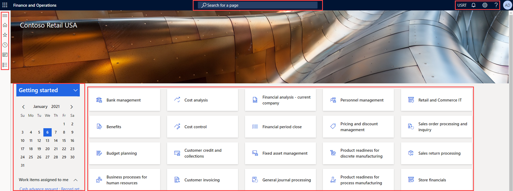
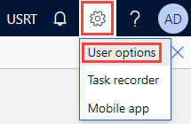

---
lab:
    title: 'Lab 1: Navigate finance and operations apps'
    module: 'Module 1: Learn the Fundamentals of Microsoft Dynamics 365 Supply Chain Management'
---

# Module 1: Learn the Fundamentals of Microsoft Dynamics 365 Supply Chain Management

## Lab 1 - Navigate finance and operations apps

## Objectives

Now that you've become familiar with finance and operations apps, take some time to explore the interface.

## Lab Setup

- **Estimated Time**: 10 minutes

## Instructions

1. On the Finance and Operations Home page, if configured, you will see:

    - The navigation menu on the left that is collapsed by default.

    - Your company's logo.

    - Workspace tiles available to you based on your role in the organization.

    - A calendar and work items assigned to you.

    - The Search bar that is very useful to quickly find what you need.

    - In the top right, you have the company you are currently working with, notifications, settings, and help links.

    

1. In the top left, select the **Expand the navigation pane** hamburger menu.

1. The navigation pane is where you'll find collections for your **Favorites**, **Recent** items, **Workspaces**, and **Modules**.

1. In the navigation pane, select **Modules** > **System administration**.

1. Review the areas available in the System administration module.

1. Under **Setup**, select **Client performance options**.

1. In the Client performance options pane, under **Feature callouts enabled**, select the toggle switch and set it to **On**.

1. Review the other available options, scroll to the bottom of the pane, and then select **OK**.

1. On the Home page, in the top right, select the Settings icon, and then select User options.

    

1. On the Options page, use the tabs to configure different settings that will apply to your account.

1. Select the **Preferences** tab.

1. Review the available preferences. Notice you can change the default company and initial page view you will see when you sign in.

1. Select and review the **Account** and **Workflow** tabs.

1. In the left navigation menu, select the **Home** icon.

1. On the Home page, in the top center of the page, select the **Search for a page** box.

1. In the search box, search for **All vendors**.

1. You may need to wait the first time you search for a page. You will see a small spinning circle to the right of the search box while the search is processing.

1. The All vendors page is an example of a list page. The list page generally contains master data that can be read, created, deleted, and updated. You'll see additional features using the ribbon shown above the list.

    

1. Highlight one of the vendors from the list and, on the right, select the **Related information** menu, and review the additional information that is provided.

1. In the vendor list, select **Northwind Traders**.

1. Select the **Group** menu, and then select the **Vendor group** column title.

    

1. Many menus have sorting and filtering available. Use the filters to quickly locate the field content you are looking for.

1. In the top right, notice the additional functionality. Move your mouse to each item, and review the feature callout. When complete, select the **Close** icon to close the page and return to the Home page.

    

1. In the upper-right, select the **Help** question mark icon, and then select **Help**.

1. Notice the help information is related to the current page.

1. Try selecting a workspace tile, and then review the help information for that workspace. When complete, return to the Home page.
